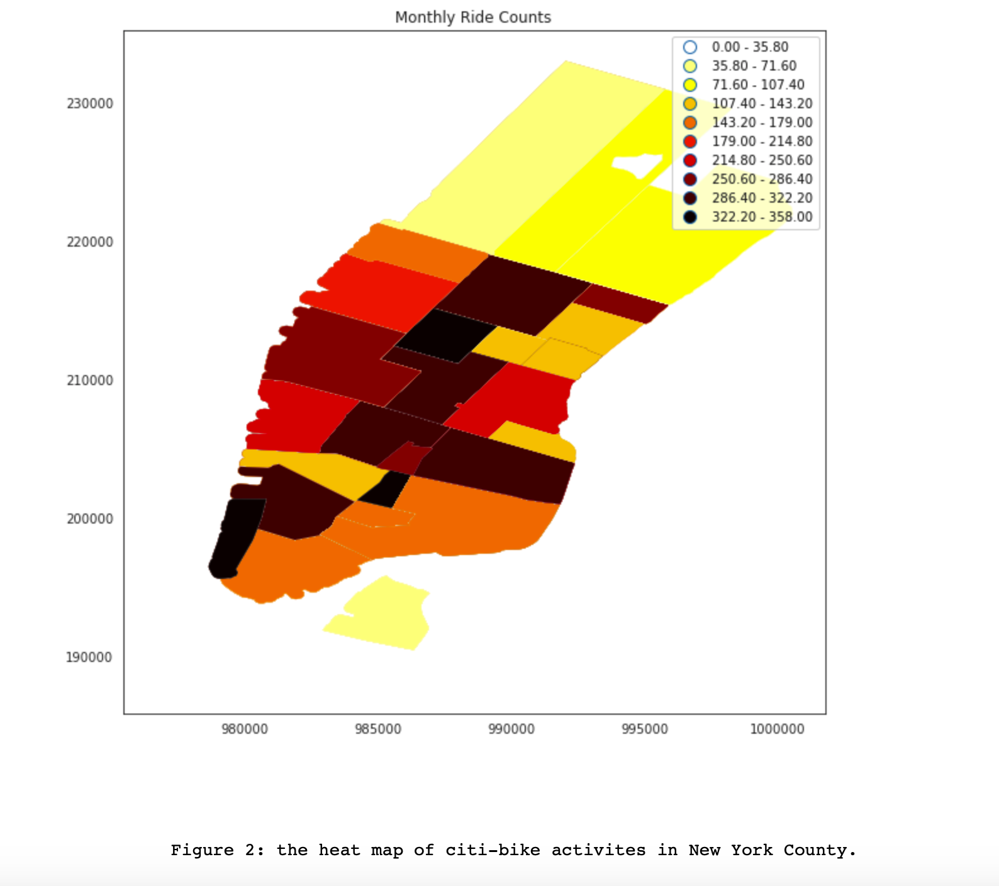

# PUI2018 HW 11

## ASSIGNMENTS:

### Assignment 1. Individule work by Songjian Li. Conducted time series analysis with MTA subway dataset. 
Consulted Yintian Cheng with some of the codes.

### Assignment 2. Improve your plot from HW8 based on the feedback
 
 Added legends, adjusted the figure scope, and explain the figures more in the captions based on the feedback.

