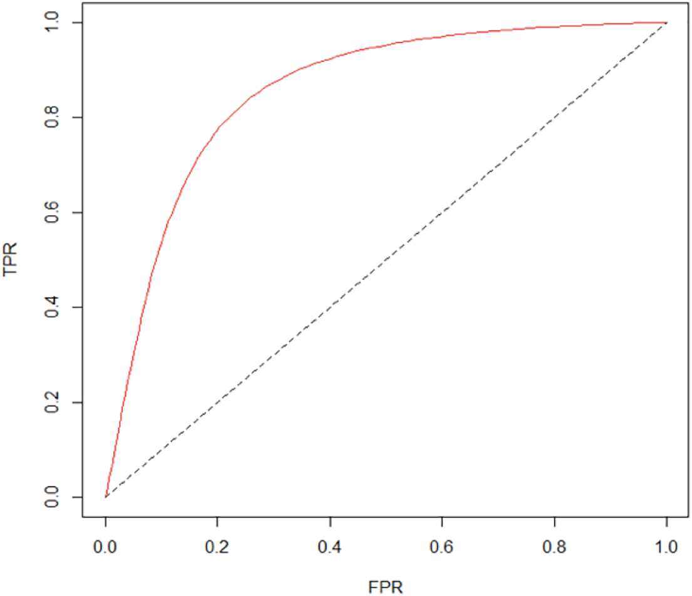

## Assignment 1: Review your classmate's Citibike project proposal
### a. Verify Null and alternative hypotheses
	-Original Null hypothesis: The average number of daily trips using 24 hour passes or 3 day passes on weekends (E) in NYC during August 2018 is the same or lower than the average amount on weekdays (D) during the same time period with a significance level of .10. (Weekends=Saturday and Sunday).
	H0: E-D<=0   

	-Original Alternative Hypothese :The average number of daily trips using 24 hour passes or 3 day passes on weekends (E) during August 2018 is significantly higher than the average amount on weekdays (D) during this same period.
	H1: E-D>0   

	Comment: 
	The Null and alternative hypothesis are formulated correctly. 
	Suggestion:
	I was a little confused by the description "using the 24 hour passes or 3 day passes" because it is not in the original dataset. I would rephrase is to "The average number of daily trips from subscribers ". 
	Also, the origial idea was "Non-membership usage (likely driven by leasure bikers, tourists & visitors) is highest on weekends." It might make more sence if changing the null hypothesis to "The average number of daily trips from non-subscribers on weekends (E) in NYC during August 2018 is the same or lower than the average amount on weekdays (D) during the same time period with a significance level of .10. (Weekends=Saturday and Sunday) H0: E-D<=0  and the alternative hypothesis: The average number of daily trips from non-subscribers on weekends (E) during August 2018 is significantly higher than the average amount on weekdays (D) during this same period.
	H1: E-D>0   

### b. Verify that the data supports the project
	I think the data has the appropriate features to answer the question. The data could be further procesed. The hypothese concerns only the absolute number of trips from subscribers/non-subscribers, therefore the features like 'bikeid','tripduration','starttime''stoptime' could be dropped.  

### c. Chose statistical test
	I think T-test would be appropriate to test the hypothesis. The data used to test the hypothesis is numerical, and the number of trips from two kinds of costomer(subscribers/non-subscribers) are unpaired. Also, there is difference between between these two groups, and theu are not linked or related with each other. So T-test is an appropriate test here.  

## Assignment 2: Literature choices of statistical tests

| **Statistical Analyses**	|  **IV(s)**  |  **IV type(s)** |  **DV(s)**  |  **DV type(s)**  |  **Control Var** | **Control Var type**  | **Question to be answered** | **_H0_** | **alpha** | **link to paper**| 
|:----------:|:----------|:------------|:-------------|:-------------|:------------|:------------- |:------------------|:----:|:-------:|:-------|
ANCOVA	| 1, the spatio-temporal supply 2,demand intensities | category | 1, driver’s response to a particular request| binary | 1, time | continuous | 	Do driver response probability significantly impacted by the spatio-temporal supply and demand intensities| the probability of the value of the nominal variable is not associated with the value of the measurement variable | 0.001 | [An empirical investigation of taxi driver response behavior to ride-hailing requests: A spatio-temporal perspective](https://journals.plos.org/plosone/article?id=10.1371/journal.pone.0198605#sec006) |
  |||||||||
  
 
  

## Assignment 3: Reproduce the analysis of the Hard to Employ program in NY:
#### Reproduce the analysis of the Hard to Employ program in NY.
#### Complete the Z-test and the Chi-squre test.

## Assignment 4: Tests of correlation using the scipy package with citibike data.
Perform KS, pearsonr, spearman test on citibike data from 2018.1 and 2018.7.